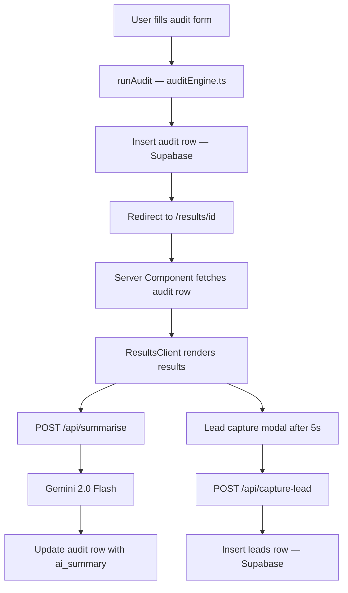

# Architecture

## Data Flow



## Stack

| Layer      | Choice                | Why                                                            |
| ---------- | --------------------- | -------------------------------------------------------------- |
| Framework  | Next.js 15 App Router | Server + client components in one project, API routes included |
| Language   | TypeScript            | Type safety on the audit engine recommendations array          |
| Styling    | Tailwind CSS          | Fast iteration, no context switching                           |
| Database   | Supabase              | Postgres + JS client + RLS in one free-tier package            |
| AI Summary | Gemini 2.0 Flash      | Free API tier, sufficient quality for a 2-sentence summary     |
| Animations | Framer Motion         | layout animations on tool rows and page transitions            |
| Deployment | Vercel                | Zero config Next.js deploys, free tier                         |

## Audit Engine

The audit engine in `lib/auditEngine.ts` is fully deterministic. It takes a list
of tool entries (toolId, plan, seats, monthlySpend), a team size, and a use case,
and returns a recommendations array.

For each tool it checks:

- Is the user on a higher plan than their seat count justifies?
- Is their declared spend higher than the plan's listed price × seats?
- Is there a cheaper alternative that covers their use case?
- Does Credex have a negotiated rate for this vendor?

All pricing constants are hardcoded and sourced in PRICING_DATA.md. No LLM is
involved in the audit logic — recommendations are consistent and testable.

## Database Schema

```sql
audits (
  id uuid primary key,
  created_at timestamptz,
  tools jsonb,
  team_size text,
  use_case text,
  total_monthly_spend numeric,
  total_monthly_savings numeric,
  total_annual_savings numeric,
  is_high_savings boolean,
  is_optimal boolean,
  recommendations jsonb,
  ai_summary text
)

leads (
  id uuid primary key,
  created_at timestamptz,
  audit_id uuid references audits(id),
  email text,
  company text,
  role text
)
```

## Key Design Decisions

**Server component for results page** — the audit row is fetched on the server
so the page is fully rendered before hydration. This means the shareable URL
works for Open Graph scrapers and the results are immediately visible without
a loading state for the main content.

**AI summary is non-blocking** — if the Gemini call fails, `ResultsClient`
falls back to a hardcoded template string. The core product never depends on
the summary succeeding.

**Lead modal fires after 5 seconds** — not immediately on page load, not on
a scroll trigger. The user sees the full results first, which makes the modal
feel like a follow-up rather than an interruption.
